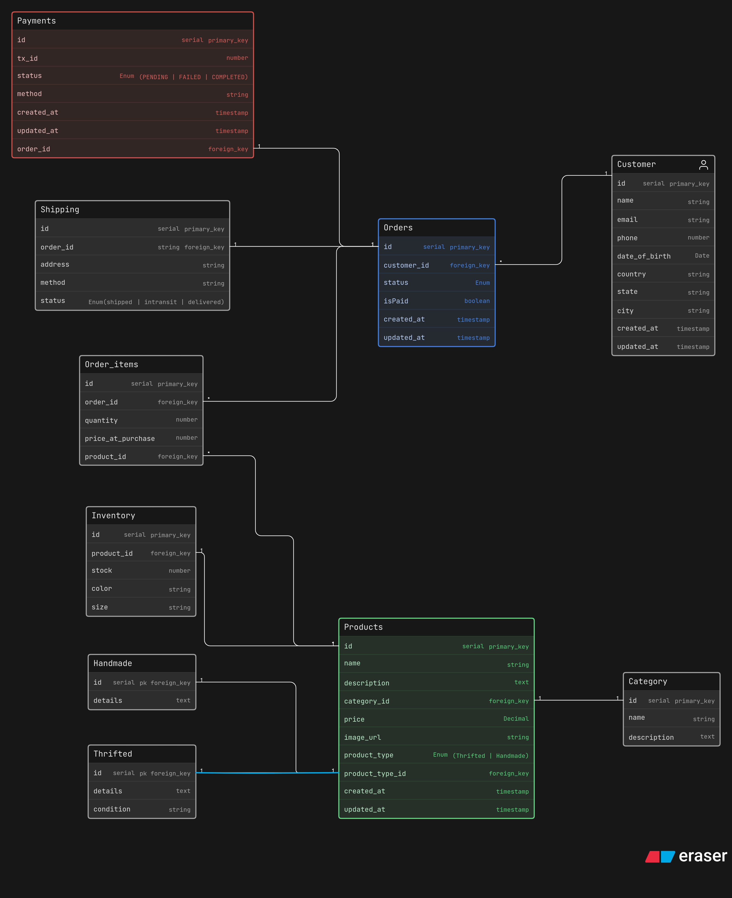

# Insta Thrift Store – DB Design

A normalized ER diagram designed for a small-scale fashion business transitioning from Instagram DMs to a structured inventory and order management system.

## 🎯 Business Logic

- **Hybrid Product Model:** Handles unique **Thrifted** items and batch-produced **Handmade** products separately.
- **Relational Integrity:** Uses a junction table (`Order_items`) to support multiple products per order and historical price tracking.
- **Operational Flow:** Dedicated entities for `Inventory` levels, `Payments` auditing, and `Shipping` status tracking.

## 🏗️ Core Entities

* **Products:** The base catalog (Name, Price, Category).
- **Thrifted / Handmade:** Specialized extensions for condition or specific details.
- **Orders & Order_items:** Captures the transaction and the specific snapshot of products sold.
- **Inventory:** Tracks stock, color, and size variants.
- **Payments & Shipping:** Decoupled status tracking for financial and logistical clarity.

